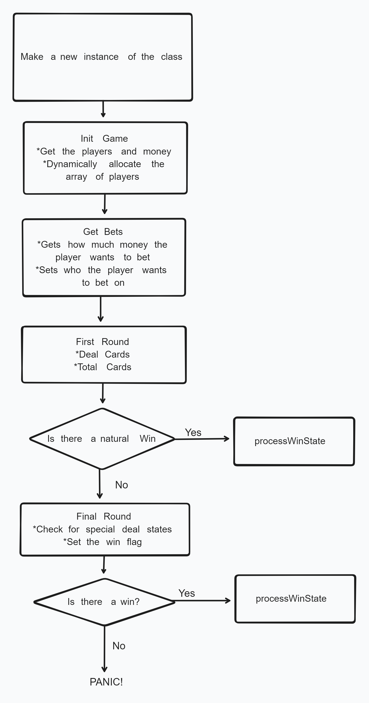

# Baccarat in C++
A simple implementation of Baccarat in C++. This implementation runs on a simplified version with a maximum number of cards
## Limitations
* Played with 2 rounds of play
* 3 Cards
## Basic Flow Diagram
